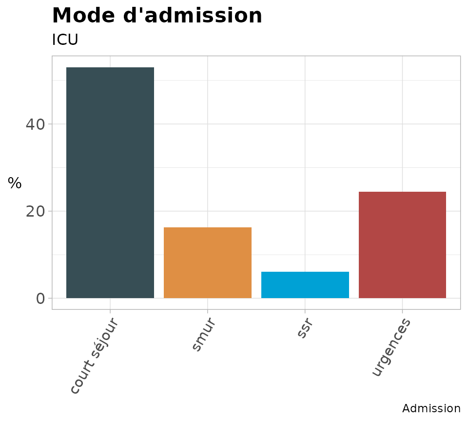
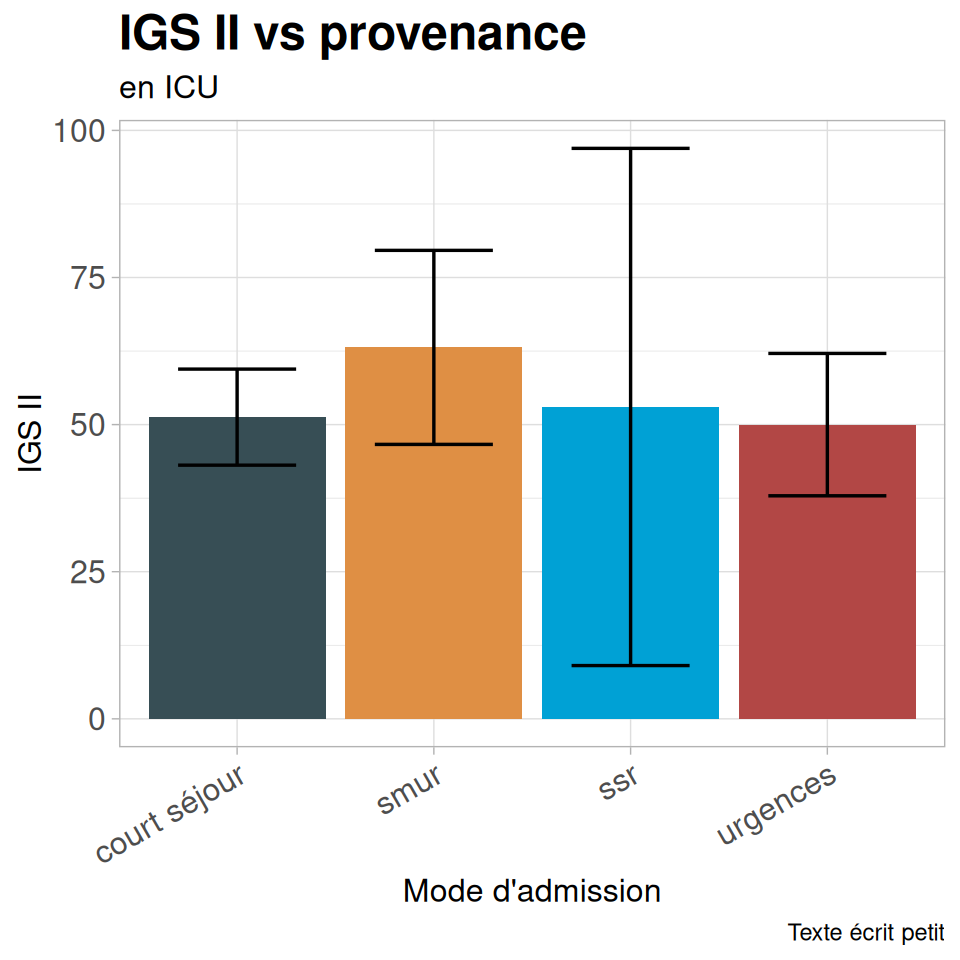
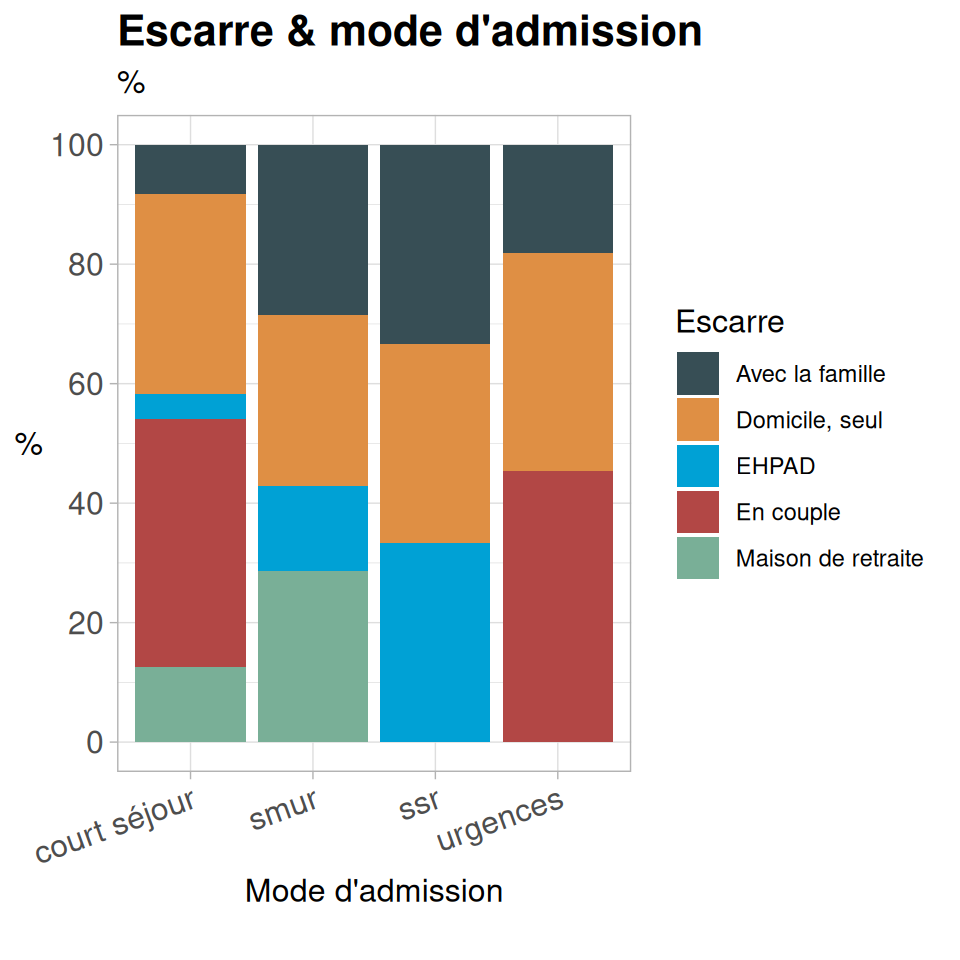
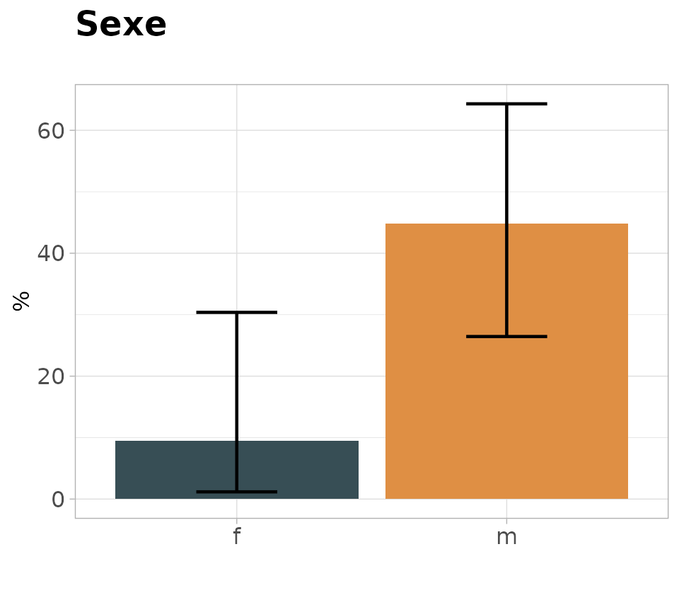
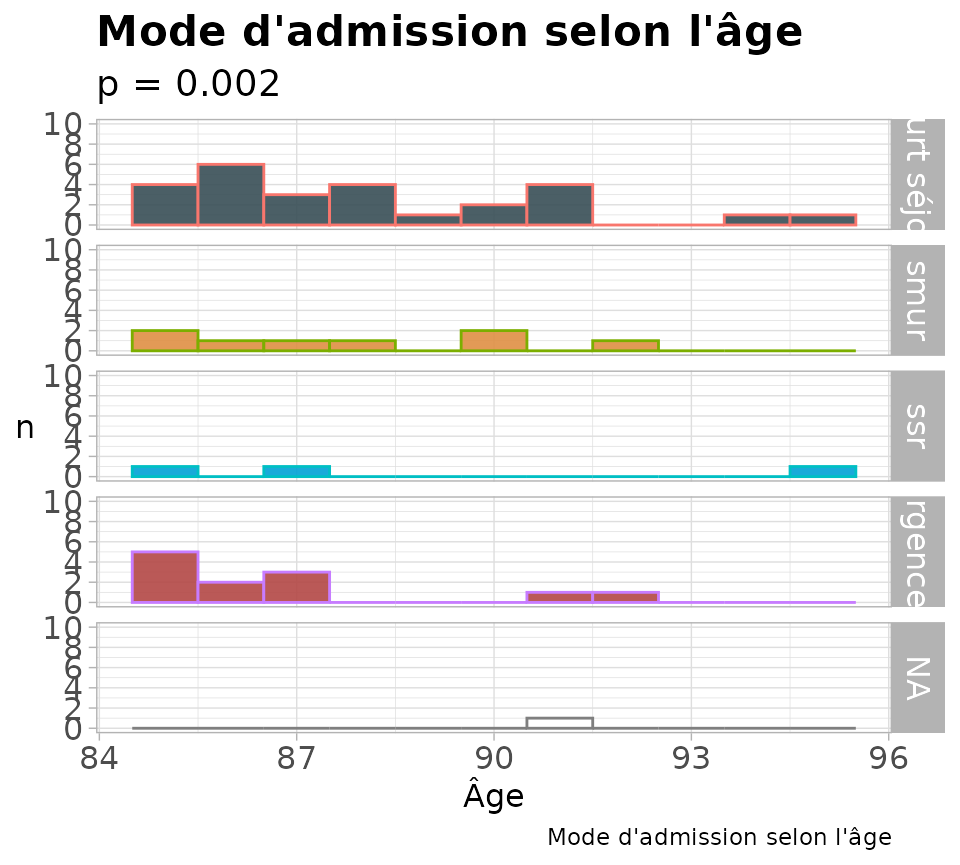
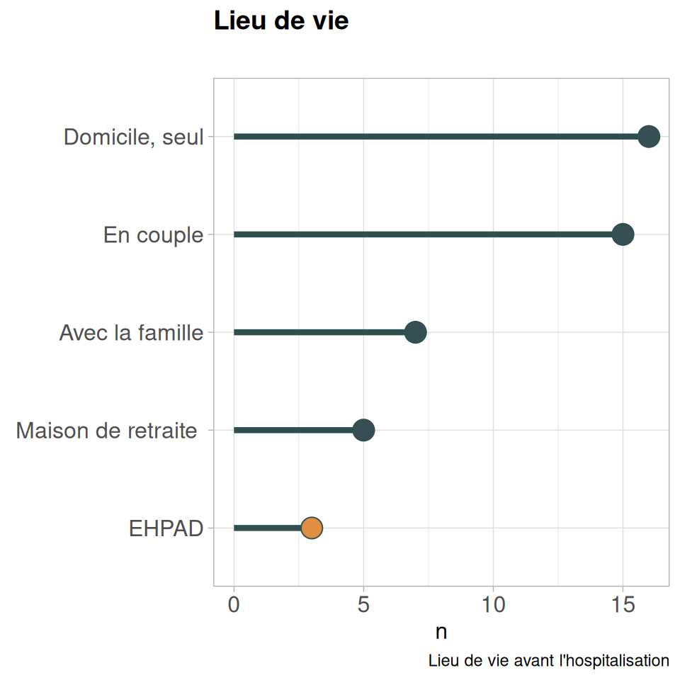
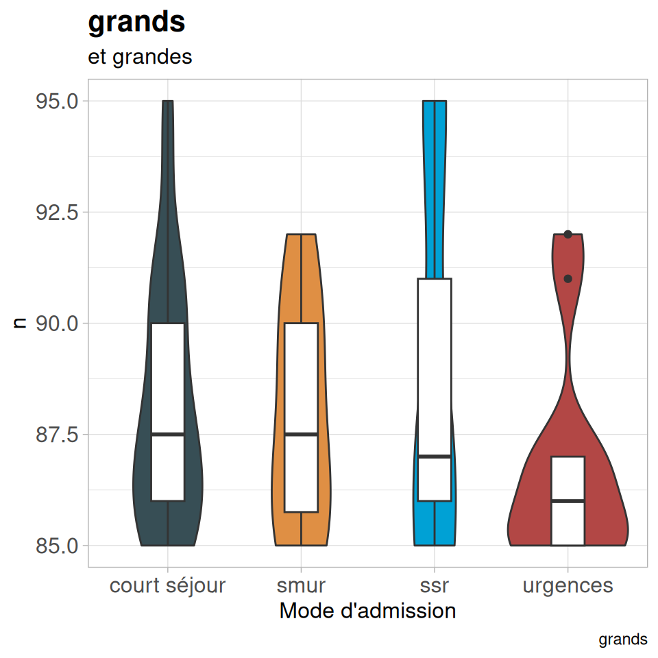
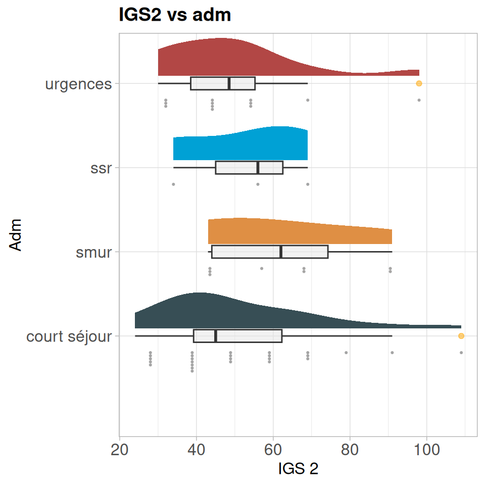
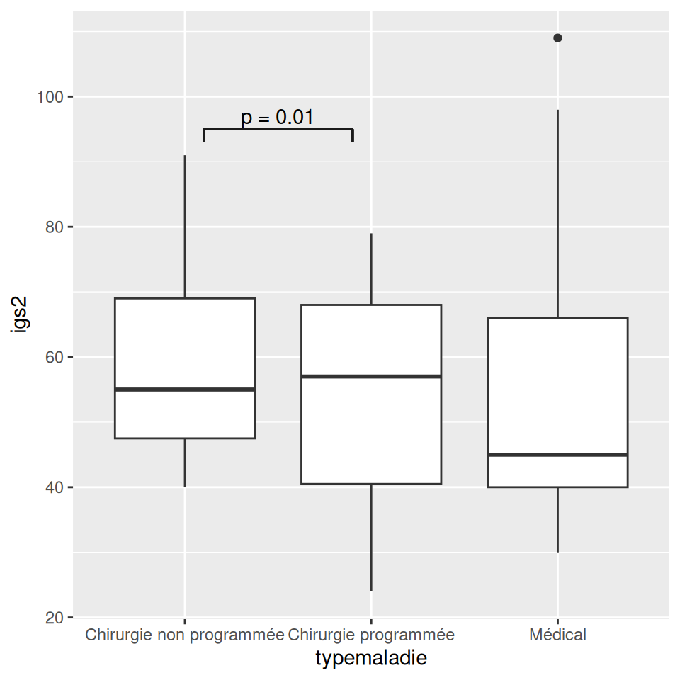

# baseph

- [Installation](#tabset-1-1)
- [Calcul du nombre de cas](#tabset-1-2)
- [Randomisation](#tabset-1-3)
- [Mise en forme des tableaux](#tabset-1-4)
- [Graphiques](#tabset-1-5)
- [Utilitaires](#tabset-1-6)
- [Import & mise en forme des données](#tabset-1-7)

&nbsp;

- ``` r
  > library("remotes")
  > remotes::install_github("philippemichel/baseph")
  ```

  ``` r
  library(baseph)
  library(gtsummary)
  library(tidyverse)
  library(kableExtra)
  # library(labelled)
  library(readODS)
  ```

  Nous allons déroulé un projet de recherche clinique tout simple à
  partir du jeu de données `patients` contenu dans le package. Ce jeu de
  données contient deux fichiers :

  - `patients` avec les données (fictives)
  - `bnom` qui contient des vignettes claires pour les variables : par
    exemple pour la variable `sejourrea` sera affiché dans les tableaux,
    légendes etc. : *Durée de séjour en réanimation*. À utiliser avec le
    package `labelled`.

C’est toujours la première étape. Plusieurs fonctions font ces calculs
pour les cas courants par exemple dans les packages `epiDisplay` ou
`Hmisc`.

Nous avons écrit ici une fonction pour les sondages, enquêtes etc. sans
test principal donc pas de calcul de puissance possible.

``` r
nbo <- nb.obs.ph(px = 0.5, ex = 0.1, np = 1e5)
```

Le nombre de cas nécessaires pour une enquète avec une estimation des
réponses pour les questions principales autour de 50 % (hypothèse la
plus défavorable) & une marge d’erreur considérée comme acceptable de 10
% dans une grande population serait de 96 cas (calcul très discutable).

la fonction `listrandph`correspond juste à une mise en forme de la
fonction `blockrand` du package homonyme pour générer des listes de
randomisation par centre en blocs de taille aléatoire. Elle génère
plusieurs fichiers .csv : une feuille globale de randomisation (pour le
promoteur) & une feuille par centre.

``` r
listrandph(nbcent = 1, # Nombre de centre
           nbtrait = 2, # nombre de traitements/classes (habituellement 2)
           nbcas = 100 # Nombre de cas total prévu
)
```

J’utilise habituellement le package `gtsummary` pour créer mes tableaux.
Les deux fonctions suivantes prennent un tableau, le mettent en forme
via `kableExtra` (pour les sorties en pdf) & font l’export en .xls
(optionnel).

## Tabph

Tabph permet de fignoler l’aspect des tables générées par `gtsummary` en
particulier le titre de l’entête au dessus des catégories, mise en gras
des titres des variables,ajout de diverses colonnes :

- p-value
- colonne **Total**
- colonne **N**des effectifs par variable.

Choix du type de tests utilisés (paramétriques ou non).

## Export en kableExtra

- `pexptabph` prépare le tableau sans régler la largeur (pour des
  tableaux qui tiennent sans problème dans la page), possibilité de
  `longtable`.

- `gexptabph` adapte le tableau pour tenir dans la page en largeur (en
  jouant sur la taille de police etc.) mais on perd la possibilité de
  `longtable` (limitation technique).

``` r
patients |>
  dplyr::select(sexe, age, escarre, lieudevie1) |>
  tbl_summary(by = escarre) |>
  tabph(nomv = "Escarre", # Titre des colonnes
        normx = TRUE # Tests paramétriques
        ) |>  
  pexptabph(exp = FALSE, # pas d'export .xls
            lg = FALSE) # pas de longtable
```

[TABLE]

## barsimpleph & bardecph

Graphique en barre simple.

``` r
barsimpleph(dfx = patients, # tableau de données
            varx = admission, # Variable à étudier
            titre = "Mode d'admission",
            stitre = "ICU", # sous-titre
            capt = "Admission", # légende
            lab = "admin", # label pour un lien éventuel
            angle = 60) # angle d'affichage des niveaux sur l'axe x
```



`bardecph` est le même graphique avec les données présentées en ordre
décroissant.

## barconfph

Graphique en barre d’une donnée numérique découpée selon une variable
factorielle avec les intervalles de confiance.

``` r
barconfph(dfx = patients, # tableau de données
          varnum = igs2, # variable numérique
          vartri = admission, # variable factorielle
          titre = "IGS II vs provenance", #
          stitre = "en ICU", tx = "Mode d'admission", # sous titre
          ty = "IGS II", # titre des y
          cap = "Texte écrit petit", # légende
          angle = 30 # angle d'affichage des niveaux sur l'axe x
)
```



## bardeuxph

Barplot pour 2 variables factorielles : une variable de tri, une
variable en % par modalité de tri

``` r
bardeuxph(patients,
          lieudevie1, # Variable en %
          admission, # variable de tri
          titre = "Escarre & mode d'admission", # titre
          stitre = "%", # sous titre
          xtitre = "Mode d'admission", # titre des x
          ltitre = "Escarre", # titre de lé légende
          angle = 20, # angle d'affichage des niveaux sur l'axe x
          lab = "aa" # label
)
```



## Barouiph

Barplot pour deux données factorielles : une de tri (axe x) & une qui
doit être à deux niveaux avec affichage d’un seul niveau (par exemple
réponse en oui/non où on affiche que les oui) avec les intervalles de
confiance.

``` r
barouiph(dfx = patients, varx =escarre, testx =sexe, valx = "oui", titre = "Sexe")
```



## histmultiph

Graphique en plusieurs histogrammes superposés, pratique pour bien
visualiser les variations d’une distribution selon une modalité.

``` r
histmultiph(dfx = patients,
            varx= admission, # bariables de tri, factorielle
            varn = age, # variable numérique
            tit = "Mode d'admission selon l'âge", # titre
            stit = 0.002, # p-value
            titx = "Âge", # titre de l'axe x
            bin = 1 # largeur des barres
)
```



## lollipopph

Tracé d’un graphique “lollipop” de distribution d’une variable
factorielle avec possibilité de mise en évidence d’un ou plusieurs
facteurs.

``` r
lollipph(dfx = patients, #
         nom = lieudevie1, # variable à afficher
         tri = c("EHPAD","Maison de retraite"), # modalités de la variable à mettre en évidence
         titre = "Lieu de vie", # titre
         capt = "Lieu de vie avant l'hospitalisation" #  légende
         )
```



## vioboxph

Graphique en violon + boxplot

``` r
vioboxph(dfx = patients, # 
         varx = admission, # Variable de tri, factorielle
         varnum = age, # variable numérique
         titre = "grands", # titre
         stit = "et grandes", # sous titre
         titx = "Mode d'admission" # titre de l'axe x
)
```



## raincloudph

Graphique en *raincloud* (densité + boxplot + nuage de points) pour une
variable numérique & une variable factorielle de tri.

``` r
raincloudph(df = patients, vcat = admission, vnum = igs2, titre = "IGS2 vs adm", titcat = "Adm", titnum = "IGS 2", adj = 1)
```



## figp

Ajoute le crochet horizontal & le texte pour une comparaison entre deux
groupes.

``` r
fp <- patients |>
 drop_na(typemaladie, igs2) |>
  ggplot(aes(x = typemaladie, y = igs2)) +
  geom_boxplot()
  figp(fp, x1 =1, x2 = 2, yy =95, pval = 0.01, od = FALSE, h = 2)
```



IL s’agit de petits utilitaires simples souvent utilisés dans les
fonctions précédentes.

## Moyennes & intervalles de confiance

### bashaut

Fonction pour calculer les bornes inférieure et supérieure d’un
intervalle de confiance à 95 % pour la moyenne d’une variable numérique.

``` r
bashaut(iris$Sepal.Length)
#> $binf
#> [1] 5.709732
#> 
#> $bsup
#> [1] 5.976934
```

### moyciph

Fonction pour calculer par bootstrap l’intervalle de confiance à 95 %
d’une moyenne.

``` r
moyciph(patients$age, ci = 95)
#>     binf     bsup 
#> 87.10051 88.60000
```

### transangph

Calcul de l’intervalle de confiance sur une loi binomiale après
transformation angulaire (utile si on est très proche de 0 ou 1).

``` r
transangph(nb = 950, total = 1000, pr = 95)
```

## Affichage

### moys

Fonction pour afficher la moyenne & l’écart-type d’une variable
numérique.

``` r
  moyciph(patients$age, ci = 95)
#>     binf     bsup 
#> 87.10051 88.60000
```

### meds

Fonction pour afficher la médianes & les quartiles d’une variable
numérique.

``` r
  meds(patients$age)
#> [1] "87 (86;90)"
```

### beaup

Affichage de la p-value

``` r
  beaup(0.0002, affp = FALSE)
#> [1] "< 0,001"
  beaup(0.05)
#> [1] "0.05"
```

### nesp

Correction d’une erreur de saisie habituelle dans les tableaux de
données : la présence d’une espace en début ou fin d’une variable
textuelle ou d’espaces multiples. ’

``` r
nesp("  Bonjour à   vous ")
#> [1] "Bonjour à vous"
```
